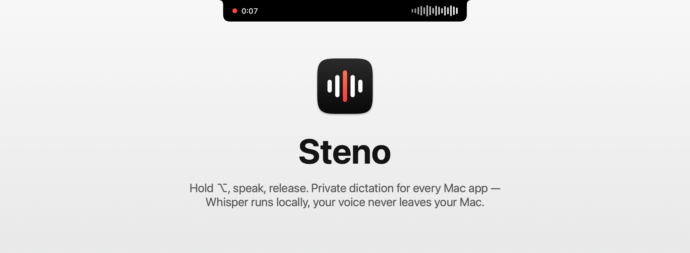
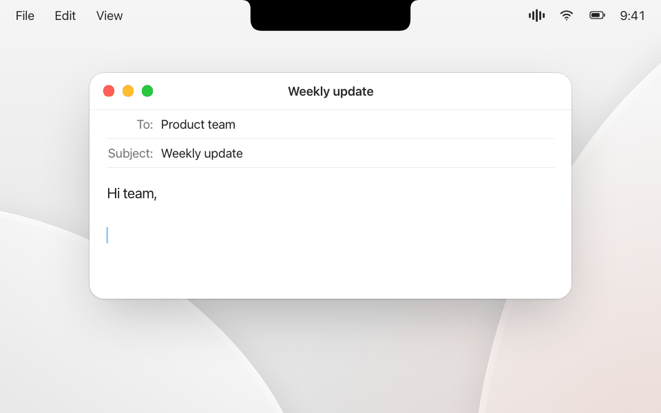
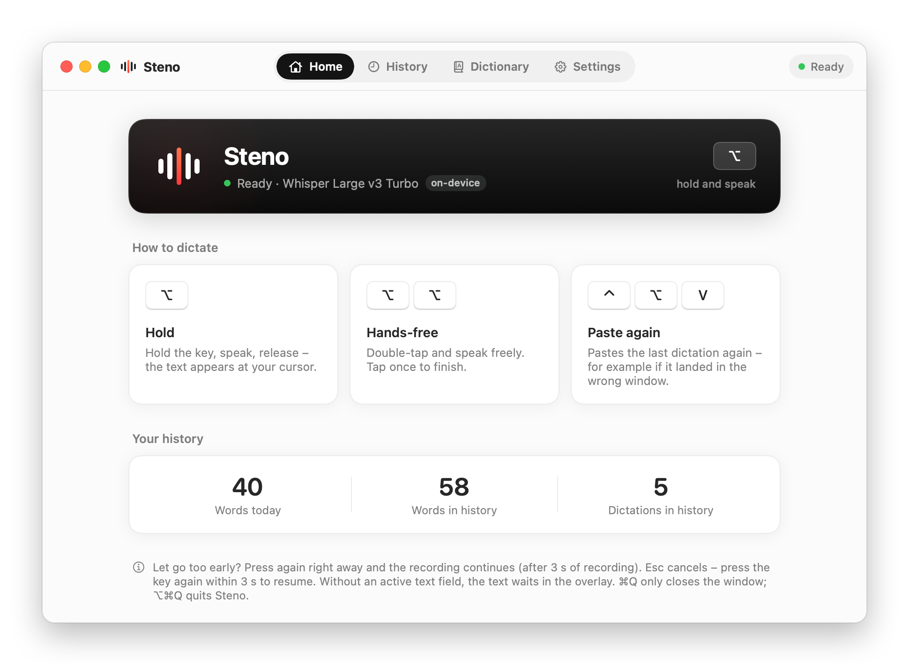

<p align="center"></p>

<p align="center">
  <b>Free, open-source dictation for macOS.</b> Hold a key, talk, and your words appear wherever you type –<br>
  transcribed on your Mac by OpenAI Whisper. No cloud, no account, no subscription.
</p>

<p align="center">
  <a href="https://github.com/Thesimpleex/steno/releases/latest/download/Steno.dmg"><b>Download for Mac</b></a> ·
  <a href="https://www.majores.store/">Website</a> · <a href="#features">Features</a> ·
  <a href="#privacy">Privacy</a> · <a href="#build-from-source">Build</a> · <a href="#deutsch">Deutsch</a>
</p>

<p align="center"></p>

---

## Why Steno

Speaking is about three times faster than typing, and dictation apps have made that workflow popular. Most of them
are subscriptions, though, and some send your voice to a server. Steno does the same job on your Mac, for free:

- Your audio and your text never leave the Mac. The only network request is the one-time model download from
  Hugging Face, pinned to a fixed revision and verified by SHA-256.
- Whisper Large v3 Turbo runs on the Apple GPU, so a sentence is usually ready in under a second.
- It works in any text field – chat apps, AI assistants, mail, editors, terminals.
- It is MIT-licensed, about 5,000 lines of Swift, with no telemetry and no dependencies beyond whisper.cpp.

## Who it's for

People who write a lot: prompts for AI assistants and coding agents, commit messages, notes and emails. People who
can't or won't send their voice to the cloud, for example because they work under professional confidentiality. And
anyone for whom typing is tiring or painful – because of RSI, dyslexia, or simply long days at the keyboard.

## Features

<p align="center"></p>

### Dictation

- Hold ⌥ (Option), speak, release – the text is pasted at your cursor. Double-tap the key for hands-free mode and tap
  once to finish; you can click, switch apps and move windows in the meantime.
- Prefer another key? Choose right ⌥, right ⌘, left or right ⌃, right ⇧ or the 🌐/fn key. Quick shortcuts with that
  key, such as ⌥L for @ on German keyboards, don't trigger dictation.
- It forgives slips: let go too early during a dictation of three seconds or more and press again right away, and it is
  still the same recording. Canceled with Esc by accident? Press the key within 3 seconds to pick up where you left off.
- ⌃⌥V pastes the last dictation again, for example when it landed in the wrong window.
- A small black overlay shows that Steno is listening. It grows out of the notch, or floats as a bubble above the Dock
  on Macs without one – automatically or as you prefer. If no text field is focused, the text waits there with a copy
  button.
- Steno adds a leading space when needed and restores your clipboard afterwards. Secrets from password managers and
  very large items are deliberately not put back, and the temporary clipboard stays on this Mac instead of going to
  your other devices via Universal Clipboard. While a password field is active, Steno neither records nor pastes.

### Recognition

- Whisper Large v3 Turbo by default, plus four other official whisper.cpp models (148 MB – 3.1 GB) that you can
  download, switch and delete in the app – or your own ggml model.
- German, Swiss German (written as Standard German with “ss”), English, French, Italian and Spanish, or automatic
  detection.
- Silero VAD removes Whisper's typical hallucinations on silence, such as “Subtitles by the Amara.org community”.

### Personal dictionary

- Add names and terms. Whisper gets them as a hint, and similar-sounding mishearings are corrected automatically
  (Levenshtein similarity plus Kölner Phonetik) – “Meyr” becomes “Meyer”, “Kubernetis” becomes “Kubernetes”. Words
  that macOS knows are left alone unless the sentence marks them as a name, so “Meer” doesn't turn into “Meyer”, and
  endings are kept (“Meyers”, “E-Mails”).
- Fixed replacements cover everything else, with a field to try them out.

### Everyday comfort

- A searchable history, grouped by day and kept for 1, 7 or 30 days – or not at all.
- Spotify and Apple Music pause while you dictate.
- Optional sounds, a copy-only mode and Open at Login.
- A setup assistant walks through language, permissions, the model download and a first test.
- The interface is available in English, German and French.

## Install

You need a Mac with Apple silicon (M1 or later), macOS 14 Sonoma or later and at least 2.5 GB of free space (about
4 GB for the largest model).

1. Download [`Steno.dmg`](https://github.com/Thesimpleex/steno/releases/latest/download/Steno.dmg) from the
   [latest release](../../releases/latest) or from the [website](https://www.majores.store/), open it and drag Steno
   to Applications.
2. Open Steno. Because it is distributed without a paid Apple Developer ID, macOS blocks the first launch. Close the
   message (**Done** or **OK**, depending on your macOS version).
3. In **System Settings › Privacy & Security**, scroll down to the note that Steno was blocked and click
   **Open Anyway**.
4. The setup assistant takes care of the rest: microphone, Accessibility and the model download.

> **Why Accessibility?** Steno needs it to notice the dictation key, to check whether a text field is focused (and
> whether the character before the cursor needs a space) and to paste the text. Key presses are never recorded or
> stored.
>
> **Updating:** builds are ad-hoc signed, so macOS may ask for the Accessibility permission again after an update.
> Steno's window then shows an **Allow** button that fixes it in two clicks.

## Privacy

- Audio is recorded **only while you dictate** and is never written to disk.
- Transcription runs **entirely on your Mac** (whisper.cpp with Metal).
- History and dictionary are plain JSON files in `~/Library/Application Support/Steno/` – yours to inspect or delete.
- No analytics, no crash reporting, no accounts. The only connection is the model download from
  [Hugging Face](https://huggingface.co/ggerganov/whisper.cpp), pinned to a fixed revision and verified by SHA-256.

## How it works

```
Hotkey ──▶ HotKeyMonitor ──▶ Dictation (state machine) ──▶ Microphone (16 kHz mono)
                                          │
                                          ▼
                      Transcriber (whisper.cpp + Silero VAD, Metal) ──▶ TextCleanup (dictionary, phonetics)
                                          │
                                          ▼
                      TextInsertion (paste at cursor) · NotchOverlay (copy) · HistoryStore
```

| File | Responsibility |
| --- | --- |
| `HotKeyMonitor.swift` | Event tap on its own thread: hold, tap, chords, Esc, ⌃⌥V |
| `HotKey.swift` | The selectable dictation keys (⌥, ⌘, ⌃, ⇧, fn) |
| `Dictation.swift` | Recording state machine: hold, hands-free, resume after Esc or an early release |
| `Transcriber.swift` | whisper.cpp wrapper on a serial queue |
| `TextCleanup.swift` | Hallucination filter, fuzzy name correction, replacements |
| `TextInsertion.swift` | Focus detection via Accessibility, paste with clipboard restore |
| `ModelStore.swift` | Model catalog, verified downloads, switching |
| `NotchOverlay.swift` | The black overlay: grows out of the notch or floats as a bubble |

## Build from source

```bash
git clone https://github.com/Thesimpleex/steno.git && cd steno
./build.sh --install          # builds Steno.app and copies it to /Applications
./release.sh                  # builds build/Steno.dmg
swift test                    # dictionary correction and hotkey logic
python3 tools/check-strings.py   # every UI string translated?
tools/screenshots.sh /tmp/steno-shots en   # renders every window (light and dark) without screen recording
```

Requires Xcode 16+ (Swift 6 toolchain). SwiftPM fetches the official, checksum-pinned whisper.cpp XCFramework.

Useful while developing:

```bash
build/Steno.app/Contents/MacOS/Steno --test recording.wav              # transcribe a file, no hotkey needed
STENO_DATA=/tmp/steno-test build/Steno.app/Contents/MacOS/Steno --setup  # setup assistant with separate data
```

`STENO_DATA` separates history, dictionary and models; settings (UserDefaults) are shared with your normal install.
Ad-hoc signed builds lose the Accessibility permission after every rebuild. Sign with your own certificate to keep it:
`STENO_SIGN_IDENTITY="Your Certificate" ./build.sh --install`.

## Contributing

Issues and pull requests are welcome. Please keep the app small and dependency-free, run `swift test`, and run
`python3 tools/check-strings.py` when you add UI text.

## License

MIT © 2026 Thesimpleex. Whisper models by OpenAI (MIT), via [whisper.cpp](https://github.com/ggml-org/whisper.cpp)
by the ggml authors (MIT). Voice activity detection: [Silero VAD](https://github.com/snakers4/silero-vad) (MIT).
Full notices: [THIRD_PARTY_NOTICES.md](THIRD_PARTY_NOTICES.md).

---

## Deutsch

**Steno ist eine kostenlose, quelloffene Diktier-App für den Mac.** Taste halten, sprechen, loslassen – der Text
steht dort, wo dein Cursor ist. Whisper läuft komplett auf deinem Mac: keine Cloud, kein Konto, kein Abo.

- ⌥ halten zum Diktieren, zweimal tippen für den Freihandmodus, Esc bricht ab (innerhalb von 3 Sekunden geht es
  weiter), ⌃⌥V fügt das letzte Diktat noch einmal ein. Die Taste ist frei wählbar: ⌥, ⌘, ⌃, ⇧ oder fn.
- Zu früh losgelassen? Ab drei Sekunden Aufnahme genügt sofortiges Drücken, dann läuft dieselbe Aufnahme weiter.
- Die Anzeige wächst aus der Notch – auf Macs ohne Notch schwebt sie als Blase über dem Dock.
- Ein eigenes Wörterbuch korrigiert ähnlich klingende Namen automatisch; Wörter, die macOS kennt, bleiben stehen.
- Modelle von 148 MB bis 3,1 GB, Verlauf mit wählbarer Aufbewahrung, Musikpause und ein Einrichtungsassistent.
- Die App gibt es auf Deutsch, Englisch und Französisch. Diktieren lässt sich auf Deutsch, Schweizerdeutsch,
  Englisch, Französisch, Italienisch und Spanisch.

**Installieren:** [`Steno.dmg`](https://www.majores.store/de/) von der Webseite oder aus den
[Releases](../../releases/latest) laden, Steno in „Programme“ ziehen, öffnen. macOS blockiert den ersten Start, weil
die App ohne kostenpflichtiges Apple-Entwicklerkonto verteilt wird: Meldung schließen, dann unter
**Systemeinstellungen › Datenschutz & Sicherheit** auf **Dennoch öffnen** klicken. Den Rest erledigt der Assistent.
Voraussetzung: Mac mit Apple-Chip (M1 oder neuer) und macOS 14 oder neuer.
